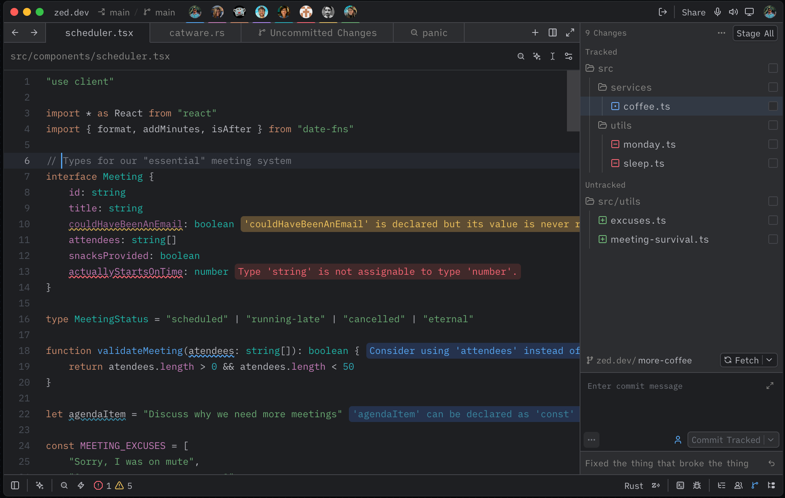

# Efa Dark Theme for Zed

A dark theme extension for [Zed](https://zed.dev), inspired by JetBrains IDEs and tuned for long coding sessions with balanced contrast.

## Theme Preview



**Efa Dark** features:
- Deep dark background (`#1E1F22`) for comfortable viewing
- Vibrant but controlled syntax highlighting
- Distinct colors for keywords, strings, functions, and types
- Italic styling for comments, booleans, and constants
- Matching terminal ANSI palette

## Repository Layout

This repository is packaged as a Zed extension:

```text
.
├── extension.toml
├── screenshots/
│   └── efa-dark-theme-preview.png
├── themes/
│   └── efa-dark.json
├── LICENSE
└── README.md
```

## Installation

Install directly from Zed's extension registry:

1. Open the command palette (`cmd-shift-p` on macOS, `ctrl-shift-p` elsewhere) and run `zed: extensions`.
2. Search for **efa dark**.
3. Click **Install** on **Efa Dark Theme**.
4. Open the theme selector with `cmd-k cmd-t` (`ctrl-k ctrl-t` on Linux/Windows) and select **Efa Dark**.

To set it permanently, add to your Zed `settings.json`:

```json
{
  "theme": "Efa Dark"
}
```

## Local Development & Testing

1. Open Zed and run `zed: extensions` from the command palette.
2. Click **Install Dev Extension**.
3. Select this repository folder.
4. Open the theme selector with `ctrl-k ctrl-t` (`cmd-k cmd-t` on macOS).
5. Select **Efa Dark** and verify UI/syntax colors.

If the theme does not appear, run `zed: open log` and check extension loading output.

## Publishing to Zed Extensions

To publish this theme in the official Zed extension registry:

1. Push this repository to GitHub.
2. Fork [`zed-industries/extensions`](https://github.com/zed-industries/extensions).
3. In your fork, add this repo as a submodule:

```bash
git submodule add https://github.com/valyefimov/zed-theme-efa-dark.git extensions/efa-dark-theme
git add extensions/efa-dark-theme
```

4. Add an entry to the top-level `extensions.toml` in the fork:

```toml
[efa-dark-theme]
submodule = "extensions/efa-dark-theme"
version = "1.0.0"
```

5. Run:

```bash
pnpm sort-extensions
```

6. Commit, push, and open a pull request to `zed-industries/extensions`.

Once the PR is merged, the extension becomes available in Zed’s extension store.

## Configuration

Set the theme directly in Zed settings:

```json
{
  "theme": "Efa Dark"
}
```

Or keep dynamic light/dark mode:

```json
{
  "theme": {
    "mode": "system",
    "light": "One Light",
    "dark": "Efa Dark"
  }
}
```

## Color Palette

- **Background**: `#1E1F22`
- **Foreground**: `#BCBEC4`
- **Blue (functions)**: `#56A8F5`
- **Orange (keywords)**: `#CF8E6D`
- **Green (strings)**: `#6AAB73`
- **Cyan (numbers)**: `#2AACB8`
- **Magenta (properties)**: `#C77DBB`
- **Teal (types)**: `#16BAAC`

## Author

**Yefimov Valentyn**

## License

MIT — see [LICENSE](LICENSE).
